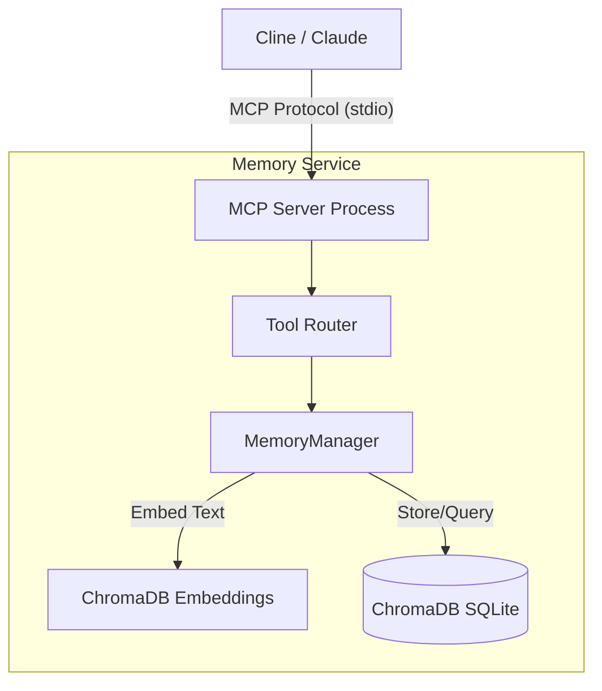

# Agentic Systems: Production-Grade Multi-Agent Infrastructure

[](https://github.com/prabhuravichandran/agentic-systems/actions)
[](https://opensource.org/licenses/MIT)

> **Status:** 🚧 Alpha | **Stack:** Python, MCP, ChromaDB, FastAPI

## 1. Problem Statement

Current LLM agents (Claude, GPT-4, etc.) suffer from **catastrophic forgetting**:
1.  **Volatile Context:** Closing a VS Code session wipes all working memory.
2.  **Expensive Re-indexing:** Re-sending 50k+ tokens of context costs $1-3 per agent run.
3.  **No Semantic Querying:** Agents cannot answer "What was the database schema decision we made last week?" without re-reading entire conversation history.

This limits agentic systems to single-session tasks and prevents them from acting as true long-term collaborators.

## 2. Solution Architecture

**Agentic Systems** provides a local-first, production-grade infrastructure for AI agents:

### Current Release: MCP Memory Server v0.1
A **Model Context Protocol (MCP)** server that gives Claude/GPT persistent, queryable memory.

**Key Features:**
- 🧠 **Semantic Memory:** ChromaDB-backed vector storage for automatic fact retrieval
- 🏷️ **Metadata Tagging:** Categorize memories (architecture, credentials, preferences)
- 🔒 **Privacy-First:** 100% local execution; no data leaves your machine
- ⚡ **Zero-Config:** Embedded database; no Docker/Postgres required

### Roadmap (Future Modules)
- **Agent Control Plane:** Distributed state management for multi-agent coordination
- **Evaluation Pipeline:** CI/CD for agent reliability testing
- **Knowledge Graph:** Entity relationship mapping for complex queries

## 3. Quick Start

### Prerequisites
- Python 3.10+
- [uv](https://github.com/astral-sh/uv) (recommended) or pip

### Installation
```bash
# Clone the repository
git clone https://github.com/prabhuravichandran/agentic-systems.git
cd agentic-systems

# Install dependencies
uv pip install -e .

# Run the MCP server
uv run python src/server.py
```

### Configuration (For Cline/Claude Desktop)
Add this to your claude_desktop_config.json:
```json
{
  "mcpServers": {
    "memory": {
      "command": "uv",
      "args": ["run", "python", "/path/to/agentic-systems/src/server.py"]
    }
  }
}
```

### Usage Example
```bash
# In your Cline chat:
# "Remember that our production database is at 10.0.0.5:5432"
# [Agent calls save_memory tool]

# Later in a different session:
# "What's the production database IP?"
# [Agent calls recall_memory and retrieves the fact]
```

## 4. Architecture
See docs/architecture.md for detailed system design.


## 5. Contributing
See CONTRIBUTING.md for development guidelines.

## 6. License
MIT License - See LICENSE for details.

Author: Prabhu Ravichandran | LinkedIn | GitHub
