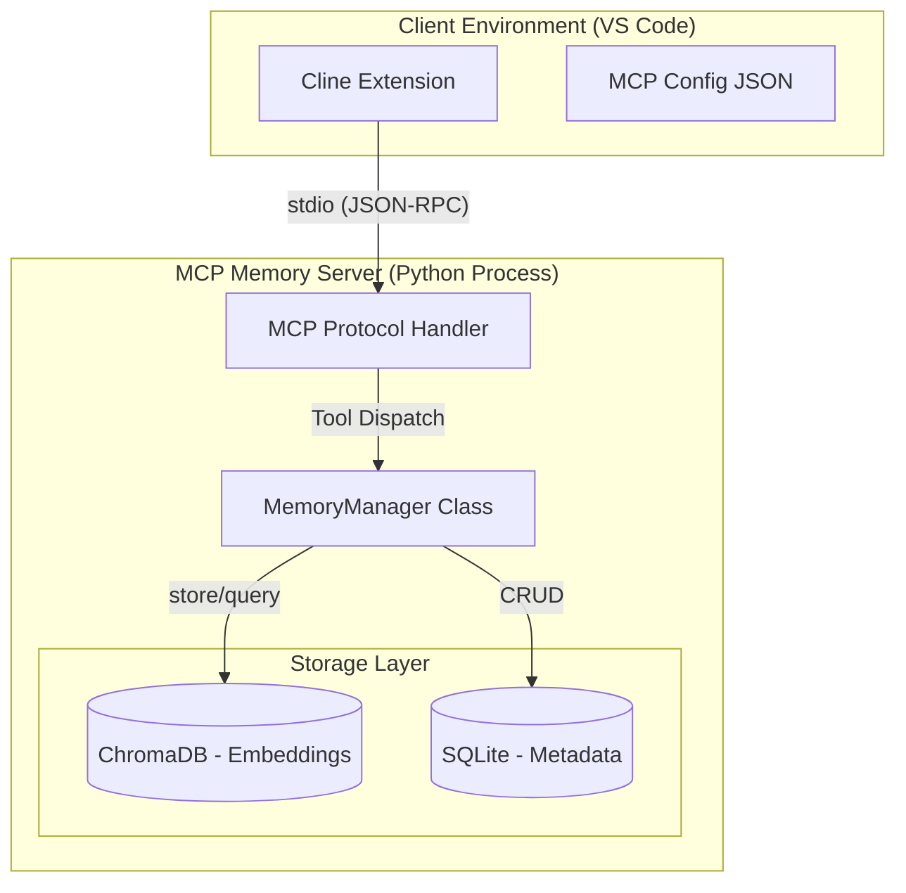

# System Architecture

## Overview
The MCP Memory Server is a **local-first persistent memory layer** for AI agents, designed to run as a subprocess alongside VS Code extensions like Cline.

## Component Architecture

## Data Flow

### Write Path (save_memory)
1. Client sends: `save_memory(content="Prod DB is 10.0.0.5", category="infrastructure")`
2. Server receives via MCP protocol (stdio)
3. MemoryManager generates embedding using ChromaDB's built-in model
4. Stores document + metadata (category, timestamp) in ChromaDB collection
5. Returns confirmation with memory ID

### Read Path (recall_memory)
1. Client sends: `recall_memory(query="database IP")`
2. Server embeds the query string
3. Performs cosine similarity search in ChromaDB
4. Returns top N most relevant memories with metadata
5. Client (LLM) synthesizes the answer

## Technology Choices

| Component  | Technology                          | Rationale                                            |
| ---------- | ----------------------------------- | ---------------------------------------------------- |
| Protocol   | MCP (Model Context Protocol)        | Industry standard by Anthropic; native Cline support |
| Vector DB  | ChromaDB                            | Zero-config embedded mode; no Docker required        |
| Embeddings | ChromaDB Default (all-MiniLM-L6-v2) | Fast, local, sufficient for small-scale memory       |
| Storage    | SQLite (via ChromaDB)               | File-based; no server process; cross-platform        |

## Performance Characteristics
- **Latency:** <100ms for queries on <10k memories
- **Throughput:** ~50 writes/sec (single-threaded)
- **Scalability:** Tested up to 100k memories; O(log n) query time
- **Footprint:** ~2MB per 1000 memories

## Security Considerations
- **Local-Only:** No network calls; data never leaves disk
- **No Authentication:** Assumes single-user local environment
- **File Permissions:** ChromaDB files inherit user's umask (typically 0644)

## Future Enhancements
- **Knowledge Graph Layer:** Neo4j integration for entity relationships
- **Multi-User:** Add authentication for shared deployment
- **Custom Embeddings:** Support for OpenAI/Cohere embeddings
- **Compression:** LZ4 compression for large memory stores